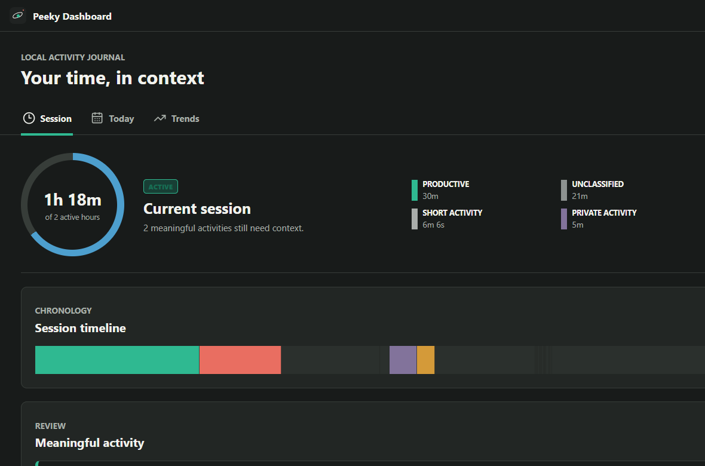
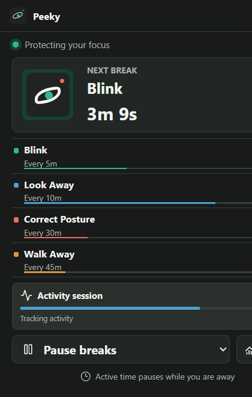
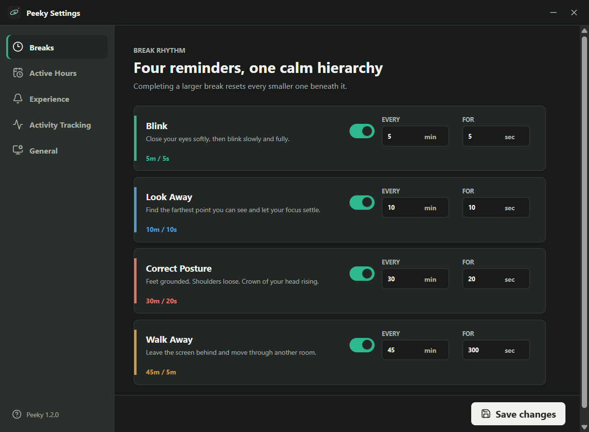

# Peeky

<div align="center">


### A small pause for long screen days

Peeky is a calm, local-first Windows break companion. It watches active computer time, then gives you one clear thing to do: blink, look away, reset your posture, or walk away.

<p>
  <a href="#download"><strong>Download Peeky</strong></a>
  ·
  <a href="#run-it-locally">Run locally</a>
  ·
  <a href="./VERCEL_DEPLOY.md">Deploy on Vercel</a>
</p>


</div>

<br />

> **The point is not to stop working.** The point is to make returning to work feel better.

## The product in one glance

| 01 · Notice | 02 · Reset | 03 · Return |
| --- | --- | --- |
| Breaks follow active computer time, not an arbitrary wall clock. | Each break is short, direct, and physical: one action, one finish line. | Pause, skip, or come back when you are ready. Peeky does not punish you for having a life. |

<div align="center">



<sub>The dashboard keeps the rhythm visible without turning your day into a spreadsheet.</sub>

</div>

## A better screen rhythm

Peeky’s four gentle rhythms are designed to be understood in a second:

| Rhythm | Cue | Default cadence |
| --- | --- | --- |
| **Blink** | Soften your gaze and blink fully. | Every 5 min · 5 sec |
| **Look away** | Find the farthest point you can see. | Every 10 min · 10 sec |
| **Posture reset** | Let your shoulders drop and sit tall. | Every 30 min · 20 sec |
| **Walk away** | Leave the screen for a proper reset. | Every 45 min · 5 min |

<div align="center">



<sub>There when you need it. Gone when you don’t.</sub>

</div>

## Built for real workdays

Peeky is deliberately quiet. It lives in the notification area, respects active time, and gives you controls instead of guilt.

- **Active-time aware** — stepping away pauses the rhythm, so you do not return to a pile of overdue alerts.
- **One useful instruction** — each break says exactly what to do and when it ends.
- **Your rules** — tune reminders, durations, active hours, sound, and overlay behavior.
- **A local journal** — optional activity sessions make your day readable without sending it anywhere.

<div align="center">



<sub>Set your rhythm once. Let Peeky handle the gentle nudge.</sub>

</div>

## Private by construction

Peeky has no account flow, no cloud dashboard, and no analytics SDK. The optional journal only needs an application name and a time range. It does not read the contents of the app you are using.

<div align="center">

| Stored locally | Never captured |
| :---: | :---: |
| Application name + timestamps | Window contents |
| Optional break history | Browser URLs or tabs |
| Settings and preferences | Keystrokes or screenshots |

</div>

Read the full promise in [the privacy page](./privacy/index.html).

## Download

Get the build that fits your Windows setup. The files are served directly from this repository; there is no account or checkout step.

<div align="center">

| Option | Best for | Link |
| --- | --- | --- |
| **Installer** | A normal Windows installation | [Download `Peeky-Setup-x64.exe`](./public/downloads/Peeky-Setup-x64.exe) |
| **Portable** | Running Peeky without installation | [Download `Peeky-Portable-x64.zip`](./public/downloads/Peeky-Portable-x64.zip) |
| **Checksums** | Verifying the release locally | [View `SHA256SUMS.txt`](./public/downloads/SHA256SUMS.txt) |

</div>

<details>
<summary><strong>Verify a download on Windows</strong></summary>

```powershell
Get-FileHash .\Peeky-Setup-x64.exe -Algorithm SHA256
Get-Content .\SHA256SUMS.txt
```

</details>

## Run it locally

This is a plain static Vite + React site. There is no database, schema, server runtime, authentication layer, or hosting-provider lock-in.

```powershell
git clone https://github.com/Harsh16Bhardwaj/peeky.git
cd peeky\website
npm.cmd install
npm.cmd run dev
```

Open [http://localhost:3002](http://localhost:3002).

### Build the deployable site

```powershell
npm.cmd run build
npm.cmd run test
```

The complete self-hostable output is written to `dist/`. Upload the **contents** of that folder to Apache, Nginx, Cloudflare Pages, GitHub Pages, Netlify, Vercel static hosting, S3, or cPanel. No Node process is needed after the build.

## Ship it on Vercel

The repository already includes a minimal [`vercel.json`](./vercel.json) and a full [Vercel deployment guide](./VERCEL_DEPLOY.md). In short:

1. Import `Harsh16Bhardwaj/peeky` in Vercel.
2. Set the **Root Directory** to `website`.
3. Use `npm run build` as the build command.
4. Set the output directory to `dist`.
5. Deploy.

Every push to `main` can then publish a new static build.

## Project map

```text
website/
├─ src/                 React pages, components, motion, and styles
├─ public/product/      Product screenshots used by the site and README
├─ public/readme/       README-only visual assets
├─ public/downloads/    Installer, portable ZIP, and SHA-256 checksums
├─ download/            Standalone download-page entry
├─ privacy/             Standalone privacy-page entry
├─ dist/                Generated production output
├─ tests/               Static smoke tests
├─ vercel.json          Vercel build/output configuration
└─ VERCEL_DEPLOY.md     Step-by-step deployment guide
```

<div align="center">

### Take the next break when it helps. Skip it when it doesn’t.

<a href="./public/downloads/Peeky-Setup-x64.exe"><strong>↓ Download Peeky for Windows</strong></a>

<br /><br />

<sub>Made for focused people who still want a body at the end of the day.</sub>

</div>
